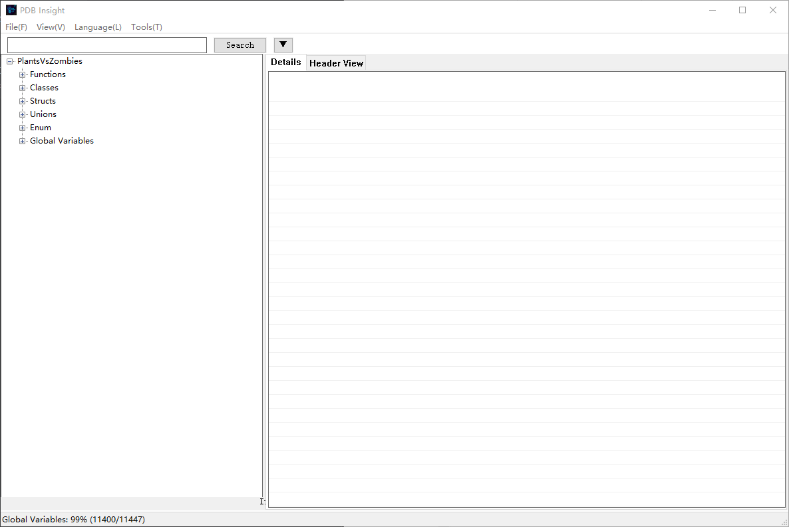
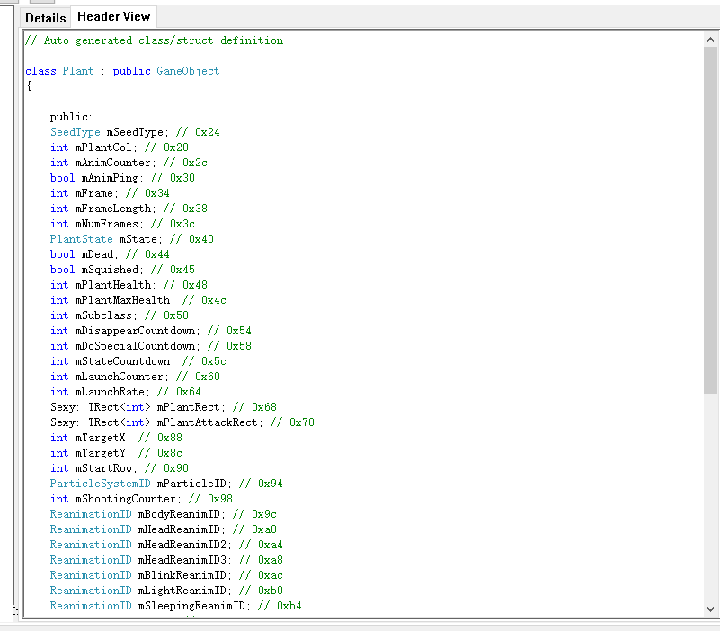

# PDB Insight

A powerful, lightweight PDB (Program Database) viewer tool based on Win32 API and DIA SDK.

---

## Screenshots

**Main Interface**



**Header View**



**Export Settings**


---

## Features

### PDB Viewing

- **Tree View** - Browse all functions, classes, structs, unions, enums, and global variables
- **Details View** - View detailed properties (name, type, offset, size, etc.)
- **Header View** - Auto-generate C++ header declarations with syntax highlighting
- **Base Class Expansion** - Expand base class members to view complete structure

### Auto PDB Download

- Open DLL/EXE files directly, auto-download corresponding PDB from symbol server
- Custom mirror source support for faster downloads
- Auto-read PE debug info (GUID, Age)
- Drag & drop support for DLL/EXE files

### Export Functionality

- **CSV Format** - Export all data, functions only, or classes only
- **XML Format** - Structured export of all symbol information
- **C++ Headers** - Export single class or batch export all headers
- **Enhanced Options** - Flatten namespaces, remove void params, include address comments

### Search Function

- Symbol search with fuzzy matching
- Search history
- Search history dropdown menu

### Multi-language Support

- Chinese (Simplified) interface
- English interface
- Auto-detect system language
- Language files embedded in exe, no external dependencies

### Number Display Mode

- Hexadecimal display
- Decimal display
- Show both

### Command Line Support

```bash
PDBInsight.exe [options] [file]

Options:
  -h, --help        Show help
  -q, --quiet       Quiet mode (no UI, for batch processing)
  -d, --download    Auto-download PDB for DLL/EXE
  -e, --export      Export format (csv, xml, header, allheaders)
  -o, --output      Output file/directory path
  -c, --class       Export specific class/struct
  -a, --all         Export all classes/structs
  -l, --list        List all classes in PDB

Examples:
  PDBInsight.exe mylib.pdb                  # Open PDB directly
  PDBInsight.exe -d kernel32.dll            # Open DLL and auto-download PDB
  PDBInsight.exe -e csv -o output.csv mylib.pdb  # Export to CSV
  PDBInsight.exe -e header -c MyClass -o MyClass.h mylib.pdb  # Export specific class
  PDBInsight.exe -l mylib.pdb               # List all classes
```

### User Interface

- Resizable splitter
- Status bar with loading progress and download status
- Keyboard shortcuts
- Right-click menu
- Drag & drop file opening (PDB, DLL, EXE)
- High DPI display support

---

## System Requirements

- Windows 7 or later

---

## Build Instructions

### Building with Visual Studio 2022

1. Open `PDBViewer.sln` solution file
2. Select configuration (Debug or Release) and platform (x64)
3. Click "Build" → "Build Solution" or press F7

### Building with Command Line

```powershell
& "C:\Program Files\Microsoft Visual Studio\2022\Community\MSBuild\Current\Bin\MSBuild.exe" PDBViewer.sln /p:Configuration=Release /p:Platform=x64
```

Output: `x64\Release\PDB Insight.exe`

---

## Project Structure

```
PDBViewer/
├── src/
│   ├── Core/                    # Core window and application logic
│   │   ├── MainWindow.cpp/h     # Main window implementation
│   │   └── PDBViewer.cpp/h      # Application entry point
│   ├── Managers/                # Manager modules
│   │   ├── AppState.cpp/h       # Global state management
│   │   ├── ConfigManager.cpp/h  # Configuration management
│   │   ├── CommandLineManager.cpp/h # Command line management
│   │   ├── ControlsManager.cpp/h    # Controls management
│   │   ├── DragDropManager.cpp/h    # Drag-drop management
│   │   ├── ExportManager.cpp/h      # Export management
│   │   ├── HeaderViewManager.cpp/h  # Header view management
│   │   ├── LanguageManager.cpp/h    # Language management
│   │   ├── ListViewManager.cpp/h    # List view management
│   │   ├── PDBDownloader.cpp/h      # PDB download management
│   │   ├── SearchManager.cpp/h      # Search management
│   │   ├── SettingsManager.cpp/h    # Settings window
│   │   ├── TreeNodeHelper.cpp/h     # Tree node helper
│   │   └── TreeViewManager.cpp/h    # Tree view management
│   └── PDB/                     # PDB parsing and export
│       ├── PDBData.h            # Data structure definitions
│       ├── PDBParser.cpp/h      # PDB parser
│       ├── PDBExporter.cpp/h    # Export functionality
│       └── PDBHeaderGenerator.cpp/h # Header generator
├── i18n/                        # Internationalization
│   ├── zh-CN.json               # Chinese language file
│   └ en-US.json                 # English language file
├── docs/                        # Documentation
├── PDBViewer.sln                # Visual Studio solution
└── PDBViewer.rc                 # Resource file
```

---

## Usage

### Basic Operations

1. Launch `PDB Insight.exe`
2. Click "File" → "Open PDB File" or press Ctrl+O
3. Click "File" → "Open DLL/EXE File" to auto-download PDB
4. Browse and select items in the left tree view
5. View detailed properties in the "Details" tab
6. View auto-generated headers in the "Header View" tab
7. Use the search box to search symbols
8. Right-click for additional functions

### Keyboard Shortcuts

| Shortcut | Function |
|----------|----------|
| Ctrl+O | Open PDB file |
| Ctrl+C | Copy selected content |
| Ctrl+F | Search |

### Right-Click Menu

#### Tree View
- Toggle offset display format (hex/decimal/both)

#### Details Table
- Copy - Copy selected cell content
- Search - Search using selected content

#### Header View
- Copy - Copy selected text
- Search - Search using selected text

---

## Technology Stack

- **Language**: C++17
- **GUI Framework**: Win32 API
- **IDE**: Visual Studio 2022
- **Core Dependency**: DIA SDK (msdia140.dll)
- **Controls**: TreeView, ListView, TabCtrl, RichEdit
- **Encoding**: Unicode

---


## Author

StackAndPointer